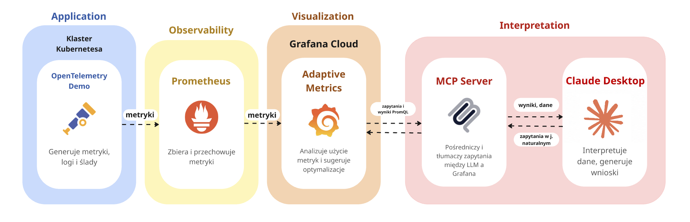
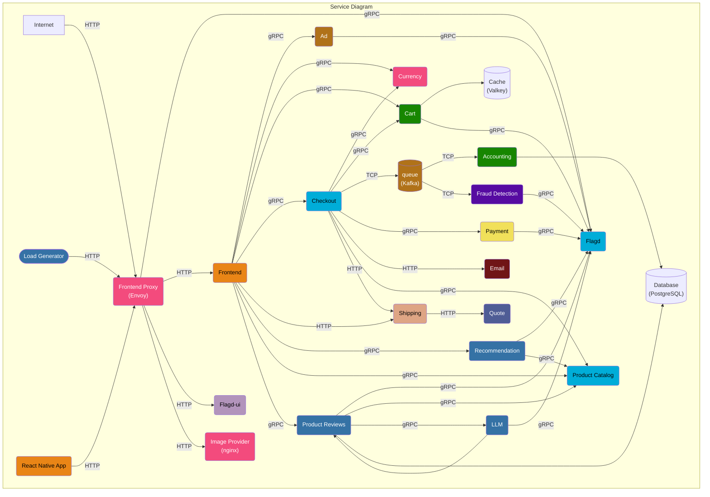
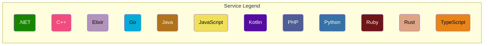
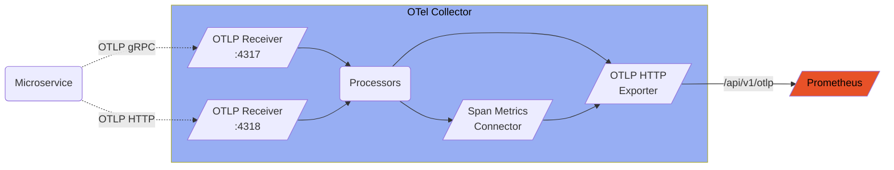
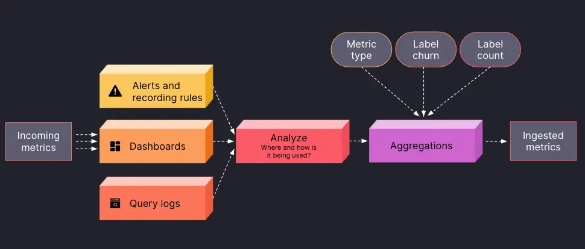
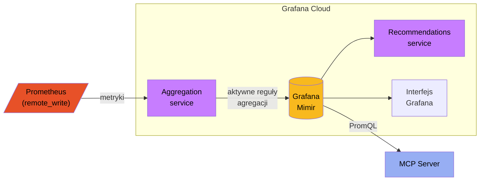
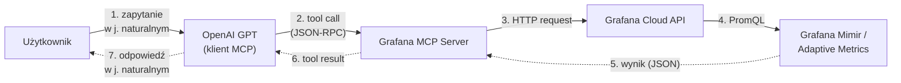

# Ada-M (Adaptive Metrics)

### Opis zadania
Grafana Adaptive Metrics umożliwia kontrolę rosnącej liczby metryk oraz związanych z nimi kosztów w Grafana Cloud. 

Poprzez analizę sposobu wykorzystania metryk w dashboardach, alertach, regułach zapisu (recording rules) oraz zapytaniach, narzędzie dostarcza rekomendacje dotyczące agregacji rzadko używanych metryk do postaci o niższej kardynalności. 

System na bieżąco ponownie analizuje sposób wykorzystania metryk, aktualizując rekomendacje w zależności od zmieniających się potrzeb w zakresie obserwowalności.

Celem projektu jest zaprezentowanie wykorzystania Grafana Adaptive Metrics na przykładzie aplikacji demonstracyjnej. Aplikacja demo powinna zostać wdrożona w klastrze Kubernetes w celu generowania danych wizualizowanych następnie w Grafana.

## Autorzy
* Gabriela Dumańska
* Diana Hunchak
* Konrad Tendaj
* Stas Kochevenko

---

## 1. Wprowadzenie

Współczesne systemy informatyczne coraz częściej budowane są w oparciu o architekturę mikroserwisową, która pozwala na zwiększenie skalowalności, elastyczności oraz łatwiejsze wdrażanie nowych funkcjonalności. Jednak wraz ze wzrostem liczby usług rośnie złożoność systemu, a zarządzanie komunikacją między serwisami, utrzymanie spójności danych oraz obsługa awarii stają się istotnym wyzwaniem.

Aplikacje działają w środowiskach rozproszonych, w których mogą występować opóźnienia sieciowe, problemy z komunikacją między usługami oraz częściowe awarie. W takich warunkach kluczowe znaczenie ma skuteczne monitorowanie systemu oraz szybkie wykrywanie problemów.

Klasyczne podejścia do monitoringu opierają się głównie na statycznym zbieraniu metryk oraz prostych systemach alertowania wymagających ręcznej konfiguracji progów i reguł. Podejście to sprawdzało się w systemach monolitycznych, jednak w architekturze mikroserwisowej okazuje się niewystarczające.

W odpowiedzi na te ograniczenia rozwinięto koncepcję obserwowalności (observability), opartą na analizie metryk, logów oraz śladów (traces), która umożliwia lepsze zrozumienie zachowania systemu oraz identyfikację anomalii.

Jednym z głównych problemów współczesnych systemów monitorowania jest wysoka kardynalność metryk, czyli duża liczba unikalnych kombinacji etykiet (labels). W praktyce prowadzi to do generowania ogromnej liczby szeregów czasowych, często zawierających szczegółowe, lecz mało użyteczne informacje, takie jak identyfikatory użytkowników, sesji czy pojedynczych żądań.

Etykiety tego typu nie mają istotnego znaczenia dla agregacji danych ani analizy parametrów takich jak opóźnienia (latency) czy liczba błędów, natomiast znacząco zwiększają ilość przechowywanych danych. W efekcie prowadzi to do większego zużycia zasobów, wyższych kosztów oraz pogorszenia wydajności zapytań.

W odpowiedzi na te wyzwania rozwijane są narzędzia takie jak Grafana wraz z funkcjonalnością Adaptive Metrics, które umożliwiają analizę wykorzystania metryk oraz ich optymalizację poprzez agregację i eliminację zbędnych etykiet, przy zachowaniu kluczowych informacji o działaniu systemu.

Dodatkowo zastosowanie modeli językowych (LLM) pozwala na automatyczną analizę danych oraz wspomaganie użytkownika w procesie diagnostyki, umożliwiając bardziej intuicyjną interakcję z systemem.


*Rys. 1: Przegląd Adaptive Metrics*

---

## 2.1 Podstawy teoretyczne

**Obserwowalność (observability)** jest podejściem związanym z monitorowaniem działania aplikacji, które umożliwia zrozumienie stanu systemu na podstawie analizy danych telemetrycznych. Pozwala nie tylko wykrywać problemy, ale również przeprowadzać ich dokładną analizę oraz identyfikować ich przyczyny.

Podstawowymi elementami obserwowalności są:
- *metryki (metrics)* – ilościowe dane opisujące działanie systemu, takie jak liczba żądań, czas odpowiedzi (latency) czy wykorzystanie zasobów,
- *logi (logs)* – szczegółowe komunikaty opisujące zdarzenia zachodzące w systemie, wykorzystywane m.in. w procesie debugowania,
- *ślady (traces)* – informacje umożliwiające śledzenie przepływu żądań pomiędzy mikroserwisami podczas realizacji operacji.

Połączenie tych elementów pozwala na pełniejsze zrozumienie zachowania systemu oraz znacząco przyspiesza proces identyfikacji i rozwiązywania problemów.


*Rys. 2: Filary obserwowalności*

Przykładem narzędzia wykorzystywanego w ramach obserwowalności jest **Prometheus**, który realizuje model typu *pull*. Jego zadaniem jest cykliczne zbieranie metryk z monitorowanych usług poprzez dedykowane endpointy, najczęściej dostępne pod adresem /metrics. Zebrane dane są następnie przechowywane w bazie szeregów czasowych (TSDB) i mogą być analizowane przy użyciu języka zapytań PromQL. Prometheus integruje się również z systemami wizualizacji, takimi jak Grafana, umożliwiając prezentację danych w formie dashboardów.

**Grafana** jest narzędziem umożliwiającym monitorowanie infrastruktury oraz wizualizację danych telemetrycznych zbieranych z różnych źródeł, takich jak Prometheus, InfluxDB czy PostgreSQL. Pozwala na prezentację metryk w czasie rzeczywistym oraz analizę danych w postaci interaktywnych dashboardów.

Dzięki Grafanie możliwe jest monitorowanie działania systemu, identyfikować problemy oraz analizować kluczowe wskaźniki, takie jak czas odpowiedzi (latency), liczba żądań czy poziom błędów. Narzędzie to wspiera również tworzenie alertów na podstawie zdefiniowanych progów oraz ułatwia interpretację danych dzięki czytelnej wizualizacji.

Jednym z istotnych rozszerzeń platformy Grafana jest funkcjonalność **Adaptive Metrics**, której celem jest optymalizacja liczby przechowywanych metryk. Mechanizm ten analizuje sposób wykorzystania metryk w dashboardach, zapytaniach oraz alertach, a następnie proponuje ich agregację oraz eliminację zbędnych etykiet, co prowadzi do zmniejszenia zużycia zasobów pamięciowych oraz poprawy wydajności zapytań.

W nowoczesnych systemach obserwowalności coraz częściej wykorzystywane są modele językowe (LLM), które wspierają analizę danych telemetrycznych. Umożliwiają one interakcję z systemem przy użyciu języka naturalnego oraz pomagają w interpretacji metryk, identyfikacji problemów i sugerowaniu możliwych rozwiązań.

W kontekście platformy Grafana funkcjonalność ta realizowana jest przez **Grafana Assistant**, który wspomaga użytkowników w procesie diagnostyki oraz analizy danych.

**Model Context Protocol (MCP)** stanowi koncepcyjną warstwę umożliwiającą integrację modeli językowych z zewnętrznymi narzędziami i systemami. Pozwala on na ujednolicenie komunikacji pomiędzy LLM a źródłami danych, takimi jak systemy monitoringu.


*Rys. 3: Koncepcyjny schemat architektury projektu (na podstawie materiałów dydaktycznych)*

---

## 2.2 Stos technologiczny

Głównym elementem technologicznym projektu jest środowisko **Kubernetes**, które umożliwia wdrożenie oraz zarządzanie aplikacją mikroserwisową w postaci kontenerów. Dzięki temu możliwe jest odzwierciedlenie rzeczywistych warunków działania systemów rozproszonych oraz generowanie danych telemetrycznych.

Jako aplikacja demonstracyjna wykorzystany zostanie projekt **OpenTelemetry Demo**, który generuje metryki, logi oraz ślady, umożliwiając analizę działania systemu w środowisku obserwowalności.

Do zbierania metryk zastosowany zostanie system **Prometheus**, który w sposób cykliczny pobiera dane z monitorowanych usług. Zebrane dane będą następnie wizualizowane przy użyciu platformy **Grafana Cloud**, która służy do wizualizacji zebranych danych.

W ramach platformy **Grafana** wykorzystana zostanie funkcjonalność **Adaptive Metrics**, służąca do optymalizacji metryk.

Dodatkowo w projekcie uwzględniono wykorzystanie modeli językowych (LLM), które wspomagają proces interpretacji wyników. Komunikacja pomiędzy systemem monitoringu a modelem językowym realizowana jest koncepcyjnie poprzez warstwę **MCP**, pełniącą rolę pośrednika pomiędzy źródłem danych a modelem.

---

## 3. Opis koncepcji case study

Celem demonstracji jest przedstawienie problemu nadmiernej liczby metryk w systemach mikroserwisowych oraz zaprezentowanie sposobu jego rozwiązania z wykorzystaniem funkcjonalności Adaptive Metrics w platformie Grafana.

W ramach demo wykorzystana zostanie aplikacja OpenTelemetry Demo, uruchomiona w środowisku Kubernetes, która generuje dane telemetryczne w postaci metryk, logów oraz śladów. Generowane dane będą zbierane przez system Prometheus i wizualizowane w Grafana (Cloud).

W pierwszym etapie demonstracji zaprezentowany zostanie problem wysokiej kardynalności metryk, wynikający z dużej liczby etykiet przypisanych do danych telemetrycznych. Taka sytuacja prowadzi do zwiększonego zużycia zasobów oraz utrudnia analizę danych w systemach monitoringu.

Następnie przedstawione zostanie działanie mechanizmu Adaptive Metrics, który analizuje sposób wykorzystania metryk w systemie (dashboardy, zapytania, alerty) oraz sugeruje ich optymalizację poprzez agregację i redukcję zbędnych etykiet.

Istotnym elementem demonstracji jest zaprezentowane porównania stanu systemu przed i po zastosowaniu rekomendacji Adaptive Metrics. Analizie podlegać będzie liczba metryk, ich czytelność oraz efektywność wykorzystania.

Końcowa część demonstracji prezentuje użyciu modelu językowego (LLM), który za pośrednictwem warstwy MCP pełni rolę inteligentnej warstwy analitycznej. Model umożliwia interpretację danych telemetrycznych oraz rekomendacji Adaptive Metrics w sposób zrozumiały dla użytkownika, wspierając proces podejmowania decyzji dotyczących optymalizacji metryk.

Scenariusz demonstracji obejmuje następujące kroki:
1. Uruchomienie aplikacji oraz generowanie ruchu w systemie.
2. Zbieranie i wizualizacja metryk w Grafanie.
3. Identyfikacja problemu wysokiej kardynalności metryk.
4. Analiza rekomendacji Adaptive Metrics.
5. Zastosowanie optymalizacji metryk.
6. Porównanie wyników przed i po optymalizacji.
7. Interpretacja wyników z wykorzystaniem modelu LLM.

---

## 4. Architektura wysokopoziomowa

W celu przedstawienia ogólnej koncepcji rozwiązania opracowano architekturę wysokopoziomową, która ilustruje główne komponenty systemu oraz przepływ danych pomiędzy nimi. Diagram koncentruje się na kluczowych warstwach odpowiedzialnych za generowanie, przetwarzanie, wizualizację oraz interpretację danych obserwowalności.



*Rys. 4: Architektura wysokopoziomowa systemu obserwowalności z warstwą interpretacji opartą o LLM*

---

## 5. Architektura szczegółowa

W poprzednim rozdziale przedstawiono ogólny zarys systemu, podzielony na cztery warstwy: aplikację generującą metryki, system obserwowalności zbierający te metryki, warstwę wizualizacji opartą o Grafana Cloud oraz warstwę interpretacji wykorzystującą model językowy. W tym rozdziale każda z tych warstw zostaje rozłożona na konkretne komponenty. Opisujemy, z czego są zbudowane, w jaki sposób są wdrażane oraz jak dane przepływają pomiędzy nimi.

## 5.1 Warstwa aplikacyjna
 
Warstwa aplikacyjna jest punktem startowym całego przepływu danych w systemie. To tutaj powstają metryki, logi i ślady, które następnie są zbierane, przesyłane do chmury i analizowane. W tej roli wykorzystano **OpenTelemetry Demo**, znaną również pod nazwą Astronomy Shop. Jest to oficjalna aplikacja demonstracyjna utrzymywana przez społeczność OpenTelemetry, której celem jest pokazanie, jak instrumentacja telemetryczna wygląda w praktyce, w realistycznym, rozproszonym środowisku [1]. Aplikacja prezentuje sklep internetowy sprzedający akcesoria astronomiczne i została celowo zbudowana tak, by przypominać systemy spotykane w rzeczywistych firmach.

### 5.1.1 Z czego składa się aplikacja
 
OpenTelemetry Demo jest zbiorem kilkunastu mikroserwisów, z których każdy odpowiada za fragment funkcjonalności sklepu. Tym, co czyni tę aplikację szczególnie wartościową dla celów demonstracyjnych, jest jej różnorodność technologiczna. Poszczególne usługi napisane są w różnych językach programowania (TypeScript, Go, Python, Java, .NET, Rust, Ruby, PHP, C++, Kotlin i innych), a komunikują się ze sobą przez gRPC oraz HTTP [2]. Dzięki temu odzwierciedla rzeczywistą sytuację w wielu firmach, gdzie różne zespoły używają różnych technologii.
 
Sercem aplikacji jest usługa `frontend` napisana w TypeScript, która odpowiada za interfejs sklepu widoczny w przeglądarce. Wszystkie żądania trafiają najpierw do `frontend-proxy` opartego o serwer Envoy, który pełni on rolę bramki wejściowej do systemu. Za frontendem znajdują się usługi domenowe związane z procesem zakupowym: `product-catalog` (Go) udostępnia katalog produktów, `cart` (.NET) zarządza koszykiem, `checkout` (Go) realizuje proces zamówienia, `payment` (JavaScript) obsługuje płatności, a `shipping` (Rust) zajmuje się wysyłką.
 
Wokół tego rdzenia funkcjonalnego krążą usługi wspomagające. `recommendation` (Python) dobiera rekomendowane produkty, `ad` (Java) wyświetla reklamy, `currency` (C++) przelicza waluty, `quote` (PHP) generuje wyceny wysyłki, a `email` (Ruby) wysyła potwierdzenia zamówień. Osobną grupę stanowią usługi przetwarzania zdarzeń. `fraud-detection` (Kotlin) analizuje zamówienia pod kątem oszustw, a `accounting` (.NET) zajmuje się księgowaniem.
 
Aby aplikacja generowała ruch nawet bez udziału użytkownika, w jej skład wchodzi `load-generator`, czyli generator obciążenia oparty o narzędzie Locust, który symuluje zachowania użytkowników (przeglądanie produktów, dodawanie do koszyka, finalizowanie zakupów). Ponadto występuje `flagd`, czyli usługa zarządzająca flagami funkcjonalności. Pozwala ona w trakcie działania systemu włączać i wyłączać określone zachowania, w tym celowo wywoływać awarie.





*Rys. 5: Architektura demonstracyjna OpenTelemetry Demo [2]* 

### 5.1.2 OpenTelemetry Collector - centralny agregator telemetrii
 
Mikroserwisy same w sobie nie wysyłają metryk bezpośrednio do Prometheusa czy Grafany. Zamiast tego każdy z nich raportuje dane do centralnego komponentu zwanego **OpenTelemetry Collector**, który stanowi element pakietu OpenTelemetry Demo. Collector pełni rolę koncentratora, który przyjmuje telemetrię ze wszystkich usług, przetwarza ją i przekazuje dalej do odpowiednich systemów docelowych.



*Rys. 6: Przepływ telemetrii przez OpenTelemetry Collector [2]* 

Collector akceptuje dane na dwóch portach. Port 4317 obsługuje protokół OTLP w wariancie gRPC, natomiast port 4318 obsługuje OTLP przez HTTP [2]. Mikroserwisy mogą wybierać dowolny z tych kanałów w zależności od bibliotek dostępnych w ich języku programowania. Po odebraniu danych Collector przepuszcza je przez tak zwany pipeline procesorów. To etap, w którym można dane filtrować, wzbogacać o dodatkowe atrybuty czy łączyć w paczki przed wysyłką.
 
Na wyjściu Collectora konfigurowanych jest kilka eksporterów. Najważniejszym z punktu widzenia tego demo jest eksporter OTLP HTTP, który wysyła metryki do Prometheusa poprzez specjalny endpoint `/api/v1/otlp`. Dodatkowo Collector korzysta z mechanizmu zwanego Span Metrics Connector. To narzędzie, które na podstawie śladów automatycznie generuje metryki opisujące tempo żądań, liczbę błędów i czas trwania operacji (model znany jako RED = Rate, Errors, Duration). Eksporter OTLP może również wysyłać same ślady do osobnego systemu jak Jaeger czy Grafana Tempo, ale w naszym demo pomijamy tę ścieżkę i koncentrujemy się wyłącznie na metrykach, ponieważ to one są obiektem optymalizacji przez Adaptive Metrics.

## 5.2 Warstwa obserwowalności
 
Warstwa obserwowalności stanowi pomost między aplikacją a chmurą. Jej zadaniem jest odebranie metryk wyprodukowanych przez Collectora, krótkoterminowe przechowanie ich lokalnie oraz przekazanie do Grafana Cloud, gdzie odbywa się właściwa analiza. Bez tej warstwy musielibyśmy konfigurować każdy mikroserwis tak, by wysyłał dane bezpośrednio do chmury, co byłoby trudne w utrzymaniu i mało elastyczne.

### 5.2.1 Prometheus w roli pośrednika
 
Centralnym komponentem warstwy obserwowalności jest **Prometheus**. To najpopularniejszy w ekosystemie cloud-native system do zbierania metryk. W naszej architekturze Prometheus pełni jednak nieco inną rolę niż klasycznie. Zwykle jest on punktem docelowym, gdzie metryki spędzają całe życie. U nas natomiast działa jako bufor i pośrednik, który przyjmuje dane od Collectora, lokalnie je składuje na krótki czas, a następnie przekazuje dalej do Grafana Cloud.
 
Prometheus odbiera metryki z OTel Collectora za pośrednictwem wbudowanego endpointu OTLP dostępnego pod ścieżką `/api/v1/otlp` [2]. Dzięki temu Collector może wysyłać dane do Prometheusa w tym samym formacie, w którym odebrał je od mikroserwisów. To jedyny kanał wejściowy w naszej konfiguracji. Wszystkie metryki, które trafiają do Prometheusa, pochodzą z aplikacji.

Zebrane dane Prometheus zapisuje w lokalnej bazie szeregów czasowych zwanej TSDB (Time Series Database). W naszym scenariuszu ta lokalna baza nie służy długoterminowemu przechowywaniu. Pełni rolę bufora gwarantującego, że dane nie zostaną utracone w przypadku chwilowych problemów z połączeniem do chmury. Pełna baza historyczna powstaje po stronie Grafana Cloud.
 
### 5.2.2 Przekazywanie metryk do Grafana Cloud 
 
Kluczowym mechanizmem w tej warstwie jest **remote_write**, czyli wbudowana w Prometheusa funkcjonalność umożliwiająca strumieniowe przesyłanie metryk do zewnętrznych systemów [3]. Konfiguruje się go przez dodanie odpowiedniej sekcji w pliku konfiguracyjnym Prometheusa:
 
```yaml
remote_write:
  - url: <Grafana Cloud Metrics remote_write endpoint>
    basic_auth:
      username: <Metrics instance ID>
      password: <Cloud Access Policy token>
```
 
Po stronie chmury metryki trafiają do Grafana Mimir, bazy danych szeregów czasowych kompatybilnej z Prometheusem, która stanowi docelowy magazyn metryk w Grafana Cloud [4]
 
Warto zatrzymać się nad pytaniem, dlaczego w architekturze pojawia się Prometheus jako pośrednik, skoro Collector teoretycznie mógłby wysyłać dane bezpośrednio do Grafana Cloud. Powody są dwa. Po pierwsze, Prometheus utrzymuje tak zwany Write-Ahead Log. Lokalny dziennik wszystkich metryk oczekujących na wysyłkę. Jeśli połączenie z chmurą się zerwie, dane nie giną. Prometheus wznowi ich wysyłkę gdy łączność wróci. Po drugie, posiadanie Prometheusa pośrodku daje nam możliwość filtrowania, etykietowania czy odrzucania określonych metryk jeszcze przed wysłaniem ich do chmury, co może mieć znaczenie zarówno dla kosztów, jak i dla prywatności danych.

## 5.3 Warstwa wizualizacji
 
Po przesłaniu metryk do chmury wkraczamy w warstwę wizualizacji, której centralnym elementem jest **Grafana Cloud**. Jest to zarządzana platforma SaaS oferowana przez Grafana Labs, zwalniająca nas z konieczności samodzielnego utrzymywania infrastruktury bazodanowej i serwerów Grafany.
 
### 5.3.1 Komponenty Grafana Cloud istotne dla demo
 
Z perspektywy naszej demonstracji w Grafana Cloud interesują nas trzy główne elementy. Pierwszy to **Grafana Mimir** — wcześniej wspomniana baza danych szeregów czasowych, kompatybilna z Prometheusem na poziomie protokołu. Mimir jest zaprojektowany tak, by skalować się horyzontalnie i przechowywać metryki przez długi czas (miesiące, lata), co byłoby trudne do osiągnięcia w pojedynczej instancji Prometheusa. To właśnie z Mimirem komunikują się wszystkie pozostałe komponenty, gdy potrzebują odczytać metryki.
 
Drugi element to **interfejs użytkownika Grafana** — dashboardy do prezentacji metryk, narzędzie Explore służące do eksploracyjnego pisania zapytań w języku PromQL oraz moduł Alerting do definiowania reguł alertowania. Z punktu widzenia użytkownika to właśnie tu odbywa się większość codziennej pracy z metrykami.
 
Trzeci element to **mechanizm Service Account Tokens** — system tokenów uwierzytelniających, używanych przez zewnętrznych klientów (takich jak nasz MCP Server) do dostępu do API Grafana Cloud. Każdy token jest powiązany z konkretnymi uprawnieniami i może być w każdej chwili odwołany, co stanowi podstawowy mechanizm bezpieczeństwa dla integracji.
 
### 5.3.2 Adaptive Metrics sercem demonstracji
 
Adaptive Metrics jest funkcjonalnością Grafana Cloud, której zaprezentowanie jest głównym celem niniejszego projektu. Pod maską składa się z dwóch współpracujących usług [5].
 
Pierwsza z nich, **recommendations service**, jest mózgiem całego mechanizmu. Jej zadaniem jest ciągłe analizowanie, w jaki sposób organizacja faktycznie korzysta ze swoich metryk. Robi to, sprawdzając cztery niezależne źródła sygnałów: dashboardy (czy jakaś metryka jest wyświetlana), recording rules (czy jest używana do prekalkulacji innych metryk), alerting rules (czy istnieją alerty oparte o nią) oraz historię zapytań ad-hoc z ostatnich 30 dni (czy ktoś jej szukał ręcznie w narzędziu Explore) [6].



*Rys. 7: Schemat działania Adaptive Metrics [6]* 
 
Na podstawie tych sygnałów każda metryka jest klasyfikowana. Jeśli żaden z czterech sygnałów jej nie dotyczy, jest oznaczana jako **nieużywana**. Jest kandydatem do całkowitego usunięcia lub bardzo agresywnej agregacji. Jeśli z kolei sygnały dotyczą metryki, ale tylko niektórych jej etykiet, jest ona określana jako **częściowo używana**. Wówczas można zachować tylko interesujące etykiety, a pozostałe zagregować. System bierze pod uwagę nie tylko sam fakt użycia, ale również typ metryki (counter czy gauge), liczbę unikalnych wartości etykiet oraz churn, czyli to, jak szybko pojawiają się i znikają poszczególne szeregi czasowe. Wyniki tej analizy są odświeżane raz na godzinę.
 
Druga usługa to **aggregation service**. To ona przyjmuje napływające dane w czasie rzeczywistym i aplikuje aktywne reguły agregacji, zanim metryki trafią do trwałego magazynu w Mimirze. Dzięki temu możemy ograniczyć liczbę przechowywanych szeregów czasowych, co przekłada się bezpośrednio na koszty oraz wydajność zapytań.
 
### 5.3.3 Przepływ danych w warstwie wizualizacji
 
Aby uporządkować wszystkie powyższe informacje, prześledźmy drogę pojedynczej próbki metryki przez warstwę wizualizacji. Próbka dociera do Grafana Cloud z Prometheusa poprzez mechanizm remote_write i trafia do aggregation service, który sprawdza, czy dla tej metryki została wcześniej zatwierdzona jakaś reguła agregacji. Jeśli tak, reguła jest aplikowana, a po przetworzeniu dane trafiają do bazy Grafana Mimir, gdzie są przechowywane w sposób trwały.

Z Mimira dane są następnie czytane przez trzy różne komponenty. Interfejs Grafana wykorzystuje je do renderowania dashboardów i odpowiadania na zapytania użytkowników. Recommendations service skanuje je, by aktualizować swoje rekomendacje co do agregacji. A nasz MCP Server, opisany w kolejnej sekcji, wykonuje na nich zapytania PromQL, by dostarczyć odpowiedzi modelowi językowemu.


*Rys. 8: Przepływ metryk w warstwie wizualizacji Grafana Cloud*

## 5.4 Warstwa interpretacji
 
Ostatnią warstwą w architekturze jest warstwa interpretacji. Jej rolą jest udostępnienie danych telemetrycznych modelowi językowemu w sposób, który pozwala użytkownikowi rozmawiać z systemem obserwowalności w języku naturalnym, zamiast pisać zapytania PromQL czy klikać po dashboardach. Komunikację między modelem językowym a Grafana Cloud realizuje protokół MCP (Model Context Protocol).
 
### 5.4.1 Grafana MCP Server
 
W roli pośrednika wykorzystany zostanie oficjalny **Grafana MCP Server**, dostępny jako projekt open source o nazwie `mcp-grafana` [7]. Jest to implementacja serwera Model Context Protocol publikowana bezpośrednio przez Grafana Labs. Serwer pełni rolę tłumacza, który przyjmuje zapytania od modelu językowego w ustandaryzowanym formacie MCP i przekłada je na konkretne wywołania HTTP API w stronę Grafany.
 
Z punktu widzenia modelu językowego MCP Server udostępnia zestaw narzędzi (w terminologii MCP nazywanych "tools"), pogrupowanych w kategorie. Najistotniejsza z punktu widzenia naszego demo jest kategoria **datasources**, która zawiera narzędzia pozwalające listować źródła danych skonfigurowane w Grafanie oraz wykonywać na nich zapytania, w tym zapytania PromQL do bazy Mimir. Druga ważna kategoria to **dashboards**, umożliwiająca przeszukiwanie istniejących dashboardów oraz pobieranie ich metadanych. Pozostałe kategorie są opcjonalne i mogą być włączane w zależności od potrzeb.
 
### 5.4.2 OpenAI GPT jako klient MCP
 
W roli modelu językowego wybrano **OpenAI GPT**. Model ten obsługuje protokół MCP po stronie klienta, co oznacza, że może odkrywać dostępne narzędzia w MCP Serverze, wybierać te właściwe dla danego zapytania użytkownika i wywoływać je z odpowiednimi parametrami. 
 
### 5.4.3 Pełny przepływ
 
Aby zwizualizować całość, prześledźmy ścieżkę pojedynczego zapytania. Użytkownik wpisuje pytanie w języku naturalnym do interfejsu rozmowy z modelem GPT. Model analizuje zapytanie i decyduje, że potrzebuje danych z Grafany. W związku z tym wykonuje wywołanie narzędzia MCP, które przekazywane jest do Grafana MCP Server działającego lokalnie. MCP Server konstruuje odpowiednie żądanie HTTP do API Grafana Cloud i  wysyła je przez internet. Grafana Cloud wykonuje zapytanie — zazwyczaj PromQL na bazie Mimir albo odczyt konfiguracji Adaptive Metrics — i zwraca wynik w formacie JSON. MCP Server odbiera ten wynik, formatuje go zgodnie ze specyfikacją MCP i zwraca modelowi. Model GPT odbiera dane, interpretuje je w kontekście oryginalnego pytania i konstruuje odpowiedź w języku naturalnym, która zostaje wyświetlona użytkownikowi.
 


*Rys. 9: Przepływ zapytania w warstwie interpretacji*

## 5.6 Środowisko Kubernetes
 
Jako środowisko uruchomieniowe wybrano minikube — lokalną dystrybucję Kubernetes uruchamianą na silniku Docker. Wybór podyktowany jest szeroką dostępnością dokumentacji i tutoriali dotyczących uruchamiania OpenTelemetry Demo na minikube [8][9] oraz dobrym wsparciem dla różnych systemów operacyjnych (Linux, macOS, Windows), co ułatwia pracę zespołową.

---

## 6. Opis środowiska

...

---

## 7. Metoda instalacji

...

---

## 8. Kroki wdrożenia demo

...

---

### 8.1 Konfiguracja

...

---

### 8.2 Przygotowanie danych

...

---

## 9. Opis demo

...

---

### 9.1 Procedura wykonania

...

---

### 9.2 Prezentacja wyników

...

---

## 10. Podsumowanie

...

---

## 11. Literatura
[1] OpenTelemetry Demo - Repozytorium GitHub. https://github.com/open-telemetry/opentelemetry-demo, data dostępu: 19.05.2026.
[2] OpenTelemetry Demo - Architecture. https://opentelemetry.io/docs/demo/architecture/, data dostępu: 19.05.2026.
[3] Grafana Cloud — Integration methods for Prometheus metrics. https://grafana.com/docs/grafana-cloud/send-data/metrics/metrics-prometheus/prometheus-config-examples/integration-guide/, data dostępu: 19.05.2026.
[4] Grafana Mimir —  Introduction. https://grafana.com/docs/mimir/latest/introduction/, data dostępu: 19.05.2026.
[5] Grafana Labs — How to aggregate metrics but retain critical data: Introducing Exemptions in Adaptive Metrics. https://grafana.com/blog/how-to-aggregate-metrics-but-retain-critical-data-introducing-exemptions-in-adaptive-metrics/, data dostępu: 19.05.2026.
[6] Grafana Labs — Introducing Adaptive Metrics. https://grafana.com/blog/adaptive-metrics-grafana-cloud-announcement/, data dostępu: 19.05.2026.
[7] Mcp-grafana — Repozytorium GitHub. https://github.com/grafana/mcp-grafana, data dostępu: 19.05.2026.
[8] SigNoz — Kubernetes Observability with OpenTelemetry. https://signoz.io/blog/kubernetes-observability-with-opentelemetry/, data dostępu: 19.05.2026.
[9] MyCloudJourney — Monitoring Kubernetes Cluster with Datadog (Minikube + OpenTelemetry Demo). https://www.wallacel.com/index.php/2025/09/20/monitoring-kubernetes-with-datadog-minikube-otel-demo/, data dostępu: 19.05.2026.

---


